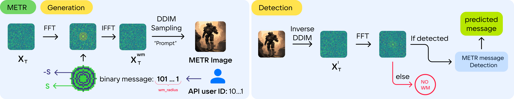

# 🚜 METR: Image Watermarking with Large Number of Unique Messages



`METR` is an attack-resistant watermarks with support of numerous unique messages,
but without image quality reduction.

This includes:
- `METR`: Message Enhanced Tree-Ring algorithm to support large number of unique messages for any diffusion model
- `METR++`: special extension for LDM that integrates both `METR` and `StableSignature` watermarks

Our paper can be found at [**arXiv**](https://www.arxiv.org/abs/2408.08340)

<details>
<summary>Abstract</summary>

> Improvements in diffusion models have boosted the quality of image generation, which has led researchers, companies, and creators to focus on improving watermarking algorithms. This provision would make it possible to clearly identify the creators of generative art. The main challenges that modern watermarking algorithms face have to do with their ability to withstand attacks and encrypt many unique messages, such as user IDs. In this paper, we present METR: Message Enhanced Tree-Ring, which is an approach that aims to address these challenges. METR is built on the Tree-Ring watermarking algorithm, a technique that makes it possible to encode multiple distinct messages without compromising attack resilience or image quality. This ensures the suitability of this watermarking algorithm for any Diffusion Model. In order to surpass the limitations on the quantity of encoded messages, we propose METR++, an enhanced version of METR. This approach, while limited to the Latent Diffusion Model architecture, is designed to inject a virtually unlimited number of unique messages. We demonstrate its robustness to attacks and ability to encrypt many unique messages while preserving image quality, which makes METR and METR++ hold great potential for practical applications in real-world settings. 

</details>

## Table of Content

<!-- TOC -->
- [🚜 METR: Image Watermarking with Large Number of Unique Messages](#-metr-image-watermarking-with-large-number-of-unique-messages)
  - [Table of Content](#table-of-content)
  - [Setup:](#setup)
  - [Running `METR`](#running-metr)
    - [Perform attacks](#perform-attacks)
    - [Evaluate FID](#evaluate-fid)
  - [Running `METR++`](#running-metr-1)
    - [Fine-tune VAE decoder to given ID:](#fine-tune-vae-decoder-to-given-id)
    - [Generate images with `METR++` watermark:](#generate-images-with-metr-watermark)
    - [Evaluate METR++](#evaluate-metr)
  - [Reproducing](#reproducing)
  - [References:](#references)
  - [Citation](#citation)
<!-- TOC -->

## Setup:

**We ran all experiments on python==3.10**:

```bash
conda create -n metr python==3.10
```

Clone repository:
```bash
git clone https://github.com/deepvk/metr.git
```

Install dependencies:
```bash
cd metr
pip install -r requirements.txt 
```

Login to your wandb and create accelerate config:
```bash
WANDB_KEY ="your/wandb/key"
wandb login $WANDB_KEY

accelerate config default
```

## Running `METR`

<details>
<summary>Generate image with a random message</summary>

To save images locally include additional argument `--save_locally` and provide path with `--local_path /path/to/save`.

```bash
accelerate launch -m metr.run_metr \
  --project_name metr_detection \
  --model_id stabilityai/stable-diffusion-2-1-base \
  --run_name no_attack --w_channel 3 --w_pattern ring \
  --start 0 --end 1000 \
  --reference_model ViT-g-14 --reference_model_pretrain laion2b_s12b_b42k \
  --with_tracking \
  --msg_type binary \
  --use_random_msgs \
  --save_locally \
  --w_radius 10 \
  --msg_scaler 100 \
  --no_stable_sig \
  --local_path generated_images
```

</details>

<details>
<summary>Generate image with a fixed message and fixed prompt</summary>

```bash
accelerate launch -m metr.run_metr \
  --project_name fixed_msg \
  --model_id stabilityai/stable-diffusion-2-1-base \
  --run_name fixed_msg --w_channel 3 --w_pattern ring \
  --start 0 --end 1 \
  --reference_model ViT-g-14 --reference_model_pretrain laion2b_s12b_b42k \
  --with_tracking \
  --freq_log 1 \
  --w_radius 10 \
  --msg_type binary \
  --msg_scaler 100 \
  --msg 1010101010 \
  --given_prompt "sci-fi bernese mountain dog"
```

</details>

### Perform attacks

<details>
<summary>Perform diffusion model attack on `METR`</summary>

```bash
accelerate launch -m metr.run_metr \
  --project_name metr_diff_att \
  --run_name diff_150 --w_channel 3 --w_pattern ring \
  --start 0 --end 1000 \
  --reference_model ViT-g-14 --reference_model_pretrain laion2b_s12b_b42k \
  --with_tracking \
  --w_radius 10 \
  --msg_type binary \
  --use_random_msgs \
  --msg_scaler 100 \
  --no_stable_sig \
  --use_attack \
  --attack_type diff \
  --diff_attack_steps 150
```

</details>

### Evaluate FID

<details>
<summary>1. Download dataset and extract:</summary>

```bash
wget -O fid_outputs.zip https://huggingface.co/datasets/Alphonsce/MSCOCO_zip/resolve/main/fid_outputs.zip?download=true
unzip fid_outputs.zip
```
[Google drive version if HF is not working](https://drive.google.com/drive/u/1/folders/1v0xj-8Yx8vZ_4qGsC5EU5FJBvEWTFmE3)

</details>

<details>
<summary>2. FID on ground-truth images (FID gt):</summary>

Argument `--image_folder` is where images are saved.

```bash
accelerate launch -m metr.run_metr_fid \
  --project_name fid_gen \
  --model_id stabilityai/stable-diffusion-2-1-base \
  --run_name no_attack --w_channel 3 --w_pattern ring \
  --start 0 --end 5000 \
  --with_tracking \
  --w_radius 10 \
  --run_generation \
  --additional_metrics \
  --run_no_w \
  --image_folder fid_eval_gt_metr \
  --msg_type binary \
  --use_random_msgs \
  --msg_scaler 100
```

</details>

<details>
<summary>3. FID on generated images (FID gen)</summary>
To evaluate FID on generated images, add argument `--target_clean_generated`:

```bash
accelerate launch -m metr.run_metr_fid \
  --project_name fid_gen \
  --model_id stabilityai/stable-diffusion-2-1-base \
  --run_name no_attack --w_channel 3 --w_pattern ring \
  --start 0 --end 5000 \
  --with_tracking \
  --w_radius 10 \
  --run_generation \
  --additional_metrics \
  --run_no_w \
  --image_folder fid_eval_gen_metr \
  --msg_type binary \
  --use_random_msgs \
  --msg_scaler 100 \
  --target_clean_generated
```

</details>

## Running `METR++`

We forked Stable Signature repository to adjust it to be comparable with `METR`. It can be found [here](https://github.com/Alphonsce/stable_signature/).

Install weights for WM extractor for Stable Signature (taken from [official Stable-Signature repository](https://github.com/facebookresearch/stable_signature) )
```bash
wget https://dl.fbaipublicfiles.com/ssl_watermarking/dec_48b_whit.torchscript.pt
```

Install full model checkpoint and config to train VAE decoder of it:

```bash
wget https://huggingface.co/stabilityai/stable-diffusion-2-1-base/resolve/main/v2-1_512-ema-pruned.ckpt
wget https://raw.githubusercontent.com/Stability-AI/stablediffusion/main/configs/stable-diffusion/v2-inference.yaml
```

**You can download our pre-trained VAE Decoder for message `111010110101000001010111010011010100010000100111`:**

```bash
mkdir -p finetune_ldm_decoder
cd finetune_ldm_decoder
wget -O ldm_decoder_checkpoint_000.pth https://huggingface.co/Alphonsce/St_Sig_vae_decoder/resolve/main/ldm_decoder_checkpoint_000.pth?download=true
```

### Fine-tune VAE decoder to given ID:

In example down below we fine-tune VAE decoder on samples from MSCOCO dataset and evaluate on images previously generated with `METR` watermark in `generated_images` folder.
Pretrained VAE decoder weights will be saved in `finetune_ldm_decoder/ldm_decoder_checkpoint_000.pth` by default.
You can change the name of checkpoint with `--checkpoint_name` argument.

<details>

```bash
TRAIN_DIR=fid_outputs/coco/ground_truth
VAL_DIR=generated_images/imgs_w

  accelerate launch -m metr.finetune_ldm_decoder --num_keys 1 \
  --ldm_config v2-inference.yaml \
  --ldm_ckpt v2-1_512-ema-pruned.ckpt \
  --msg_decoder_path dec_48b_whit.torchscript.pt \
  --train_dir $TRAIN_DIR \
  --val_dir $VAL_DIR \
  --with_tracking \
  --project_name finetune_ldm_decoder \
  --run_name test \
  --output_dir finetune_ldm_decoder \
  --batch_size 4 \
  --steps 100 \
  --num_val_imgs 200 \
  --not_rand_key \
  --key_str 111010110101000001010111010011010100010000100111
```

</details>

### Generate images with `METR++` watermark:

To generate images with `METR++` watermark, just remove `--no_stable_sig` argument and provide a path to tuned VAE decoder: `--decoder_state_dict_path /path/to/decoder/weights`:

<details>

```bash
VAE_DECODER_PATH=finetune_ldm_decoder/ldm_decoder_checkpoint_000.pth

accelerate launch -m metr.run_metr \
  --project_name metr_detection \
  --model_id stabilityai/stable-diffusion-2-1-base \
  --run_name no_attack --w_channel 3 --w_pattern ring \
  --stable_sig_full_model_config v2-inference.yaml \
  --stable_sig_full_model_ckpt v2-1_512-ema-pruned.ckpt \
  --start 0 --end 1000 \
  --reference_model ViT-g-14 --reference_model_pretrain laion2b_s12b_b42k \
  --with_tracking \
  --msg_type binary \
  --use_random_msgs \
  --w_radius 10 \
  --msg_scaler 100 \
  --save_locally \
  --local_path metr_pp_generated_images \
  --decoder_state_dict_path $VAE_DECODER_PATH
```

</details>

### Evaluate METR++

<details>
<summary>1. Evaluate Stable Signature part of METR++</summary>

Evaluation is performed on a folder of generated images, you need to pass folder into `--` with images generated with `Stable-Signature` watermark.

```bash
EVAL_FOLDER=metr_pp_generated_images/imgs_w

accelerate launch -m metr.metr_pp_eval_stable_sig \
  --project_name eval_st_sig \
  --with_tracking \
  --run_name test \
  --eval_imgs False --eval_bits True \
  --img_dir $EVAL_FOLDER \
  --output_dir eval_st_sig_logs \
  --msg_decoder_path dec_48b_whit.torchscript.pt \
  --attack_mode none \
  --key_str 111010110101000001010111010011010100010000100111
```

</details>

<details>
<summary>2. Evaluate FID for METR++</summary>

To evaluate FID for images with `METR++` watermark pass `--use_stable_sig` argument.
```bash
accelerate launch -m metr.run_metr_fid \
  --project_name fid_gen \
  --model_id stabilityai/stable-diffusion-2-1-base \
  
  --run_name no_attack --w_channel 3 --w_pattern ring \
  --start 0 --end 5000 \
  --with_tracking \
  --w_radius 10 \
  --run_generation \
  --additional_metrics \
  --run_no_w \
  --image_folder fid_eval_gt_metr_pp \
  --msg_type binary \
  --use_random_msgs \
  --msg_scaler 100 \
  --use_stable_sig
```

</details>

## Reproducing

To reproduce all experiments from our paper see [`reproducibility.md`](./reproducibility.md)

## References:

1. Tree-Ring Watermark ([Repository](https://github.com/YuxinWenRick/tree-ring-watermark), [Paper](https://arxiv.org/abs/2305.20030))
2. Stable Signature ([Repository](https://github.com/facebookresearch/stable_signature), [Paper](https://arxiv.org/abs/2303.15435))
3. Generative Model Watermark Attacker ([Repository](https://github.com/XuandongZhao/WatermarkAttacker), [Paper](https://arxiv.org/abs/2306.01953))

## Citation

```
@misc{deepvk2024metr,
      title={METR: Image Watermarking with Large Number of Unique Messages}, 
      author={Alexander Varlamov and Daria Diatlova and Egor Spirin},
      year={2024},
      eprint={2408.08340},
      archivePrefix={arXiv},
      primaryClass={cs.LG},
      url={https://arxiv.org/abs/2408.08340}, 
}
```
